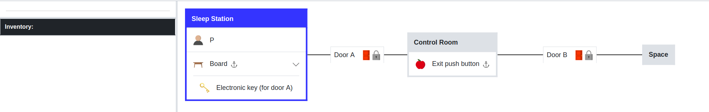

Chapter 1 : How to Design a Customized Logic
==============================================

TextWorld is a framework to train and test reinforcement learning agents to play text-based games. It enables
generating games from a game distribution parameterized by the map size, the number of objects, quest length and
complexity, richness of text descriptions, and more.

The platform is designed to support basic elements of the game such as rooms, doors, supporters, containers, etc.
Each basic element has a specific type (such as thing, player, etc.) and is defined in a logic file with `.twl`
extension. In fact, a logic file basically defines every required logic of the game to communicate with the framework
of the TextWorld as well as Inform7. Each element of the game has a logic file; however, all those files are aggregated
to each other and create a single logic for the whole game. Figure 1 depicts a sample of an element which its type is
"Thing".

.. |thing_sample| image:: ./images/thing_sample.png
    :alt: Thing version

+------------------+
|  |thing_sample|  |
+==================+
|      Thing       |
+------------------+

There are different sections in a logic file which provide required data to the framework as well as Inform7 to
follow the state change of the game. The basic question is how?
This tutorial addresses this question by designing a new type of element for the game which can perform in addition
to the rest of the elements within the TextWorld platform.

Moreover, each new game may require new type of element(s) beyond those basic elements provided in the platform.
As an example, a game happening in spaceship requires either some new elements or editing some features of basic
elements. All these customized logic files, which belong to the new game, should be stored in separate folder rather
than the framework's data files. Further details are described at section {Design A new game}.

First things first; let's start with a new logic file.

A. Design Of A New Logic
==========================
Each logic file contains various sections based on the features the designer would like to define for the element.
The body of a logic file is two things: type and descriptions.

Type of an element defines the category of the element within the TextWorld environment, such as thing, object, door,
etc. Each element type can be define with a letter or word; e.g. a thing can be called as `t` and a door can be called
as either `d` or `door`. Each game includes various types in which some types are grouped into a super type, for
instance "thing" is a super type which includes door, container, etc., and "inventory" is a single type which is
independent from thing. Members of a super type are named such that the element and its main category are clarified,
like `d : t` which indicates that the door is a sub-category of the thing. This is given as

.. code-block:: bash

    type d : t

After defining the type of an element, the description of the logic comes inside two curly brackets `{.}`. The
description includes various sections. Let's explore each section in details.

TextWorld performs with two different languages simultaneously; the TextWorld's logic language (called TWLL) and the
Inform7 language (I7L). The TextWorld compiler understands TWLL and the Inform7 can communicate with I7L. Any logic
that the designer creates or edits for a game, should be defined in both languages. So far we have only defined the
element's type in TWLL. The type and potential characteristics of this type (which the latter is optional) should also
be defined in I7L. Each logic file includes some sections which each is used to define a feature of the logic. The
first section, which is introduced, is the inform7 section. In this section, any logic (syntax) defined in TWLL is also
translated to I7L and collected in the inform7 section. Following is an example in which the type of the object is
defined in both languages.

.. code-block:: bash

    type d : t {

        inform7 {
            type {
                kind       :: "door";
                definition :: "door is openable and lockable.";
            }
        }
    }

The above example presents the type in both languages. The designer, here, prefers to add two features to the "door
type", as openable and lockable. Any feature which is supposed to be as general feature of this type can be mentioned
in `definition`. Moreover, if there is an initial state that the designer prefers to define to start the game with,
should be mentioned in the definition part. For instance, the designer of our example game likes to have all doors in
the game locked by default, when the game starts. Then "A door is usually locked." is added to definition. Similarly
for a cloth, we can say "cloth are cleanable. A cloth is usually clean.".

Each game usually include a few rooms with various elements in them. The combination of the initial state of each
element of the game (like a door which is either locked or open) creates the initial state of the game in general. The
game continues state-to-state when the current state of any element of the game changes, e.g. the locked door changes
to unlocked (but closed). This is how the Text-based games perform.

The next section of a logic file is a "Predicate", which describes various state definition of the logic of the element
using the TWLL. For instance, the states of a door can be either open/close or locked/unlocked. Another feature that
can be defined as predicate is the connectivity of this element with other element(s) in the environment. For example,
a door can link two rooms, described as `link(r, d, r')`, or an object like a glass can be put on a supporter like a
table, described as `on(o, s)`, which `o` stands for object type and `s` stands for supporter type. Any other feature
which defines the state of the element (in some way it also describes the state of the game), and designer would like
to add it, should be described for the framework in TWLL format in the predicate part. Following
is an example of the possible states of a door, in TWLL:

.. code-block:: bash

    predicates {
        open(d);
        closed(d);
        locked(d);

        link(r, d, r');
    }

In this example the door can be locked, closed, or open. The unlock state is implicitly defined by closed state. This
door also links two rooms as described. After defining predicates in TWLL, similar to previous part, the predicates
should be described in I7L as well. The following code presents this in both languages

.. code-block:: bash

    # door
    type d : t {
        predicates {
            open(d);
            closed(d);
            locked(d);

            link(r, d, r');
        }

        inform7 {
            type {
                kind       :: "door";
                definition :: "door is openable and lockable.";
            }

            predicates {
                open(d)   :: "The {d} is open";
                closed(d) :: "The {d} is closed";
                locked(d) :: "The {d} is locked";

                link(r, d, r') :: "";  # No equivalent in Inform7.
            }
        }
    }

There are important notes in this example which is good to elaborate them:

    a. The Inform7 language is very close to simple English language. However, some conditions and exceptions are
    applied. For details of Inform7 language please check `http://inform7.com`.

    b. Each type has a unique name which can be a letter or a word. The letter `d` here refers generally to a door type
    of element in the game. A door also have a specific name in the game which helps to identify it among all the doors
    in the game e.g. "wwoden door". Assigning a specific name to each element of the game is generally an appropriate
    solution to distinguish between different elements of the same type (like wooden door vs. glass door). This name
    is assigned to `{d}` in the I7L-based text; i.e. "The wooden door is open".

    c. There might be some predicates that the designer would like to define as the logic of the game and they don't
    have an I7L equivalent necessarily, like `link(.)` in this example. The framework basically understands it by
    defining as empty I7L-based description and performs as designer's wish with no harm.

    d. To make a line as comment, just put a `#` sign at the beginning of the line.

Door is a simple example to start learning the TWLL and I7L in a logic file. However, door is a built-in element inside
the TextWorld framework. Basically a door links two rooms and if it lockable, there is a key in the game which is
matched with this door. Key is also a built-in element. TextWorld has some built-in designed elements and many games
may require other element(s) rather than the built-in ones. One relevant example which is NOT already in the built-in
elements list is "push button". The framework doesn't know neither what is a push button nor whether it can
open a door, i.e. let's assume that a game designer likes to create a game in which a door can be unlock and open by a
push button. What does she/he do?
Similar to the door, we first need to describe the type and predicates of the push button as described here:

.. code-block:: bash

    # push button
    type b : t {
        predicates {
            pushed(b);
            unpushed(b);

            pair(b, d);
        }

        inform7 {
            type {
                kind :: "button-like";
                definition :: "A button-like can be either pushed or unpushed. A button-like is usually unpushed. A button-like is fixed in place.";
            }

            predicates {
                pushed(b)   :: "The {b} is pushed";
                unpushed(b) :: "The {b} is unpushed";

                pair(b, d)  :: "The {b} pairs to {d}";
            }
        }
    }

The push button is presented by `b` letter, it is basically a sub-set of thing, and it is paired with a door. However,
"pair" action is not defined in I7L, thus it should be defined and described for Inform7 that what it means when a door
and a push button are paired. The description of new concept to I7L is provided in "code" sub-section within the
inform7 section in the logic file.

.. code-block:: bash

    # push button
    type b : t {
            ...

        inform7 {
            ...

            code :: """

                connectivity relates a button-like to a door. The verb to pair to means the connectivity relation.

                Understand the command "push" as something new.
                Understand "push [something]" as _pushing.
                _pushing is an action applying to a thing.

                Carry out _pushing:
                    if a button-like (called pb) pairs to door (called dr):
                        if dr is locked:
                            Now the pb is pushed;
                            Now dr is unlocked;
                            Now dr is open;
                        otherwise:
                            Now the pb is unpushed;
                            Now dr is locked.

                Report _pushing:
                    if a button-like (called pb) pairs to door (called dr):
                        if dr is unlocked:
                            say "You push the [pb], and [dr] is now open.";
                        otherwise:
                            say "You push the [pb] again, and [dr] is now locked."
            """
        }
    }

In this example, the "push" command is defined; the compiler expects to have a syntax such as "push [something]" which
the [something] usually is replaced by the name assigned to the push button. It is also described that what changes
are expected to happen when the button is pushed; the button state should change from `unpushed` to `pushed`, the door
state also should be changed from `unlocked` to `open`. The last block is for human interaction and prints out these
changes, thus, it is not mandatory.

After defining the new instructions to model push button in the game based on inform7 language, next step is to define
a command (or rule) to activate the action on both languages. "Rule" section is another section of logic file. It
describes how the game transforms from one state to another by using the command; see the below example for a simple
`open` rule for a door,

.. code-block:: bash

    open/d :: $at(P, r) & $link(r, d, r') & $link(r', d, r) & closed(d) -> open(d) & free(r, r') & free(r', r);

where `at(P, r)` means "the player is at the room" and `free(r, r')` means the path from room r to room r' is clear.
This rule includes two columns which are separated by a `::`. The left column presents the rule's name. This name
should be unique for each rule, thus, if we have two states with different conditions, then their names should be
different, for instance "open/d" vs "open/c" which stand for open door and open container, consecutively.

The right column of the above rule describes the state change of the game according to the current change and the next
state which the game will turn to, by using this command. As it is depicted, each state contains some predicates
which describe the conditions applied to the elements of the game at that moment (or state) of the game, and provides
eligibility for the defined rule to be applied/called. After calling the rule, it is activated and makes some changes
into the state of the game (or equivalently some selected elements of the game) as it is described on the right side of
the arrow. By these changes, the game will finally transit to the next state. Please be notified that any predicate
which is supported by `$` sign will be kept as unchanged at the next state.

Equivalently, the I7L version of this rule should be coded in the inform7 part, which is translated again as `open {d}`.
When this command is imported by the player, the inform7 will return a response as the game state, which in this example
is `opening {d}`. This inform-based output is important for the TextWorld framework to identify that the inform
compiler has taken the action of the command (here opening the door) and has transited to the next state. This can be
assumed as acknowledgment to the framework to change the status. All these information are coded in `command`
sub-section inside the inform7 part in the logic file, which is given as

.. code-block:: bash

    inform7 {
            ...

            commands {
                open/d :: "open {d}" :: "opening {d}";
            }
        }
    }

Similarly, to open a locked door with a push button, it is necessary to have the player at the same room as the push
button is. Then the door is paired with the button, and the two rooms that this door connects to each other should be
declared (note: the door and the button can be located in two different rooms, see the second set of rules below).
Also the door is locked and the button is unpushed. From the `code` section, we realized that the defined command for
this state transition is "push {b}". After this action, the door is unlocked and open and the button is changed to
pushed. The rest of the conditions (predicates) are unchanged. This process is presented in following example for two
scenarios: a) the button and the door ar at the same room, b) the push button is in separate room than the door.

.. code-block:: bash

    rules {
        lock/close/db   :: $at(P, r) & $at(b, r) & $pair(b, d) & $link(r', d, r) & $link(r, d, r') & pushed(b) & open(d) & free(r, r') & free(r', r) -> unpushed(b) & locked(d);
        unlock/open/db  :: $at(P, r) & $at(b, r) & $pair(b, d) & $link(r', d, r) & $link(r, d, r') & unpushed(b) & locked(d) -> pushed(b) & open(d) & free(r, r') & free(r', r);

        lock/close/d/b  :: $at(P, r) & $at(b, r) & $pair(b, d) & $link(r', d, r'') & $link(r'', d, r') & pushed(b) & open(d) & free(r', r'') & free(r'', r') -> unpushed(b) & locked(d);
        unlock/open/d/b :: $at(P, r) & $at(b, r) & $pair(b, d) & $link(r', d, r'') & $link(r'', d, r') & unpushed(b) & locked(d) -> pushed(b) & open(d) & free(r', r'') & free(r'', r');
    }

    reverse_rules {
        lock/close/d/b :: unlock/open/d/b;
        lock/close/db  :: unlock/open/db;
    }

    inform7 {
        ...

        commands {
            lock/close/d/b  :: "push {b}" :: "_pushing the {b}";
            unlock/open/d/b :: "push {b}" :: "_pushing the {b}";

            lock/close/db   :: "push {b}" :: "_pushing the {b}";
            unlock/open/db  :: "push {b}" :: "_pushing the {b}";
        }
    }

As this example illustrates, since the same command is used for an action in two different situations, the rule names
are different, although the command and the inform7 acknowledgement are all the same.

Have you noticed the reverse_rule section? In this section, the reverse rules are connected to each other to inform the
framework that after taking an action what would be the reverse action to get back to the current state. This provides
the possibility of getting back to a state after moving from it, also provides back and forth exploration within the
environment.

The last section of a logic file is the `constraints` which defines the failure rules; i.e. describes that which
predicates cannot occur simultaneously in a state. This section is only required to be defined in TWLL. Following is an
example of some selected constraints applied to our example,

.. code-block:: bash

    constraints {
        # Predicate conflicts
        d1 :: open(d)   & closed(d) -> fail();
        d2 :: open(d)   & locked(d) -> fail();
        d3 :: closed(d) & locked(d) -> fail();

        # A door can't be used to link more than two rooms.
        link1 :: link(r, d, r') & link(r, d, r'') -> fail();
        link2 :: link(r, d, r') & link(r'', d, r''') -> fail();
    }

Chapter 2 : How To Design A New Text Grammar
==============================================
In addition to logic files, each game requires a grammar file in which it describes various sentences to be used within
the game. For example, when the player enters a room, a few lines of the greetings to the game, introduction of the
room, the items inside the room, etc. are displayed for the player. This text is compiled by a word parser at Inform7
using a customized text-grammar file. This file also should be designed by the designer of the game and stored with
`.twg` extension.

To describe this file, it is better to start with greetings. Greetings is a set of various sentences which will be
picked by the parser randomly and will be displayed on output anytime the player either enters into the game or enters
into a room. The greeting should include a general description about the state of the game, the room, or the current
elements of the game. If the generated sentence requires importation of elements or status of the game, that should
also be coded into the sentence. The question is how? Here, we practice writing such sentences.

Let's first explore a fixed type of greetings.

.. code-block:: bash

    GREETING : GREETING!;GREETINGS TREKKIE!;HELLO ASTRONAUT!;ALRIGHT THEN!; HEY  TREKKIE

Here, `GREETING` is the code to call the greeting sentence and the right side of semicolon is an array-like of different
options that the parser can pick between them; e.g. in above example, there are five different options and each time the
parser randomly picks one of them as the greeting of the game. Each of these five has the same probability; thus, if we
want to increase the probability of one item, we can repeat that as much as we wish. Moreover, each phrase above is
fixed and will be used as it is. However, it is possible to have a sentence which can be reformed based on the
situation. Following is an example of flexible greeting,

.. code-block:: bash

    Flex_greeting : #GREETING#, it is TextWorld

This example explains that we may have "Greeting!, it is TextWorld" or "HEY  TREKKIE!, it is TextWorld", or any other
combinations that we can mix and match from "Flex_greeting" and "GREETING". In other words, any word (or combination of
words which are attached by hyphen) and comes in between "#", is like a symbol of another vector of phrases and is
replaced by the parser with one of the phrases from that vector. Following is another example of the creation of the
flexible sentence:

.. code-block:: bash

    dec : #GREETING# #dec_type##suffix_(r)#;#dec_type##suffix_(r)#

    dec_type : #reg-0#;#difficult-0#
    suffix_(r) : . Okay, just remember what is your mission here to do, and everything will go great.; \
                 . You try to gain information on your surroundings by using a technique you call 'looking.'; \
                 . You can barely contain your excitement.;
                 . The room seems oddly familiar, as though it were only superficially different from the other rooms in the spacecraft.; \
                 . You decide to just list off a complete list of everything you see in the module, because hey, why not?;

    reg-0       : #01#;#02#
    difficult-0 : #03#

    01 : #dec_find-yourself# in a (name);#dec_guess-what# (name)
    02 : Well, here we are in #dec_a_the# (name)
    03 : You're now in #dec_a_the# (name)

    dec_find-yourself : You #dec_what#
    dec_guess-what    : #dec_well-guess#, you are in #dec_a_the# place we're calling #dec_a_the#
    dec_a_the         : a;the
    dec_what          : are;find yourself;arrive
    dec_well-guess    : Guess what;Well how about that;Well I'll be

In this example, assume that the #GREETING# #dec_type##suffix_(r)# is randomly picked, to replace GREETING, dec_type,
and suffix_(r) variables, respectively, the "HELLO ASTRONAUT!", "reg-0", and ". Okay, just remember what is your mission
here to do, and everything will go great." are chosen. To replace reg-0, the parser randomly picks "02", and to replace
"02", the "Well, here we are in #dec_a_the# (name)" is selected. In the latter choice of phrase we have two type of
variables, one is "dec_a_the" and the other is "(name)". The first has already described and let's assume that "the" is
picked. For the second, the (name) is replaced by the name of a room that the player is in. Rooms and their names are
described in next chapter. Finally, the created sentence is as follows:

.. code-block:: bash

    HELLO ASTRONAUT! Well, here we are in the (name). Okay, just remember what is your mission here to do, and everything will go great.

This sentence is made for a sample state and anytime the game reaches to this state the (name) is replace with the
corresponding room's name and is printed on the screen. To increase the variety of the outputs, a designer can expand
those sentence block to more and more options. However, it is always important to notice that these sentences
should comply with the scenario of the game in general and the specific scene of the game in each state. We recommend
to make a good use of general sentences, and specific type of sentences which can be fed by variable from the game
state (between parentheses variables). Following this advice can give better sentence in accordance to the game story.

Although the design of a text-grammar file is more depend on the designer's preference rather than the logic file, yet,
there are some sections which should be considered in .twg file. The fundamental sections are named as

    1. Expandables  	        : All required combinations, structures, etc of words, letters, and numbers which are used in the whole text of the grammar.
    2. Verbs         	        : All verbs which are used as action or simply as verb in the text are collected.
    3. Types & Variables        : Type of objects and variables of the game are defined and coded.
    4. Objects Garmmar	        : The grammar of each object of the game is defined in this section.
    5. Room Description Grammar : All the texts which are used to describe the game inside different rooms are defined and expanded.
    6. Instructions Grammar     : The grammar of instructions for compound commands, etc are described.

Expandables are all the variables which comes in between "#"s and expand to create a sentence. Verbs are also some sort
of expandable in which different synonyms and tense of the verb and its corresponding synonyms are clarified to be used
in text creation and hesitate from repeating a verb frequently, see below example for "take" verb,

.. code-block:: bash

    take        : #take_syn_v# the #obj_types# from the (r).;#take_syn_v# the #obj_types# that's in the (r).
    take_syn_v  : take;retrieve;grab
    take_syn_pp : taken;got;picked
    taking      : taking;getting;picking

    take/s      : #take_syn_v# the #obj_types# from the #on_var#.

    take/c      : #take_syn_v# the #obj_types# from the #on_var#.

"take_syn_v" and "take_syn_pp" respectively refer to the list of synonyms and the past participle of those
synonyms; the ing-form of the verb is the following line. Similar to the logic file description, if we have to assign a
word in different application, like take vs. take from a table, these two can be distinguished by assigning different
code words for each set. To understand this, take a look at above example and compare the definition of "take" with
"take/s".

Types of all elements in the game can be coded for the grammar to address much easier. For example, "obj_types : (o|k|f)"
indicates all the object, key, or food with the `obj_types`, while "on_types : (c|s)" refers to container or supporter
types which object-like can be put `on` it. Recall that the left-side of the semicolon is just a symbolic way of
representing something which comes on the left-side; so, it is just for text generation and there is no logic behind it.

In "Objects Grammar" section, every element of the game can have their own grammar and customized nouns and adjectives
to create more sense of the world that the designer tries to build. As an instance, a room can generally be expanded by
an adjective and a noun; if the game refers to an office (work type of room), then the list of adjective-noun pairs
could be different, and based on the game story, the designer can add as much as combinations she/he wishes, to add
more flavour to her/his game. Below is a good example of how different rooms can be assigned with their
own grammar,

.. code-block:: bash
    # --- Rooms ---------------------------------------------------------------------
    ##   List each type of room with a ';' between each
    ##   Each roomType must have specific rooms
    ###  Creating a room: first, take the name of the roomtype as listed under #room_type# (let's call it X for now).
    ###                   Then, create three symbols with this: X_(r), X_(r)_noun, and X_(r)_adj.
    ###                   X_(r) will always be composed of X_(r)_adj | X_(r)_noun. If you want to subdivide a roomtype into two or more variants, you can add _type1, _type2, etc at the end of the noun and adj symbols.
    ###                   Make sure that these changes are also accounted for in the X_(r) token.

    room_type : clean;cook;rest;work;storage

    (r)       : #(r)_adj# | #(r)_noun#
    (r)_noun  : sleep station;crew cabin;washroom;closet;kitchenette;module;lab;lounge
    (r)_adj   : nondescript;plain

    ### >  Rest Room
    ### >> Sleep Room
    rest_(r) : #rest_(r)_adj_type_1# | #rest_(r)_noun_type_1#;#rest_(r)_adj_type_2# | #rest_(r)_noun_type_2#

    rest_(r)_noun_type_1 : sleep station;sleep station;sleep station;sleeping bag;crew cabin
    rest_(r)_adj_type_1  : cozy;relaxing;pleasant;sleepy
    ### >> fun with friends
    rest_(r)_noun_type_2 : lounge;playroom;recreation zone;crew cabin;crew cabin;crew cabin
    rest_(r)_adj_type_2  : fun;entertaining;exciting;well lit;silent

Majority of the text which is created by the parser belongs to the description of a room. The Room Description Grammar
expands all the grammar which is used for a room to describe the room as well as the scenario at that room. This process
is very similar to what we described in Greetings section.

Last but not least is the "Instructions Grammar". This part basically includes all the required grammatical structures
which the text-based game needs to compound two actions (like unlock and open), separate two sentence from each other or
to connect them with a word, etc. which are important in the expansion of the sentences all over the game. Following is
a few examples of what is designed for the Spaceship game:

.. code-block:: bash
    # --- Compound Command Description Functions ------------------------------------
    ig_unlock_open      : open the locked #lock_types# using the (k).; \
                          unlock and open the #lock_types#.; \
                          unlock and open the #lock_types# using the (k).; \
                          open the #lock_types# using the (k).
    ig_unlock_open_take : open the locked #lock_types# using the (k) and take the #obj_types_no_key#.; \
                          unlock the #lock_types# and take the #obj_types_no_key#.; \
                          unlock the #lock_types# using the (k), and take the #obj_types_no_key#.; \
                          take the #obj_types_no_key# from within the locked #lock_types#.

    # --- Separators -----------------------------------------------------------------
    ##  *--- Action separators
    action_separator_take : #afterhave# #take_syn_pp# the #obj_types#, ; \
                            #after# #taking# the #obj_types#, ; \
                            With the #obj_types#, ; \
                            If you can get your hands on the #obj_types#, ; \
                            #emptyinstruction#;
    action_separator_eat  : #afterhave# #eat_syn_pp# the #eat_types#, ; \
                            #after# #eating# the #obj_types#, ; \
                            #emptyinstruction#;

    ##  *--- Separator Symbols
    afterhave : After you have;Having;Once you have;If you have
    after     : After;

For further details on these expandables, please check the TextWorld's Spaceship game.

Chapter 3 : How To Design A New Game
==============================================
To design a new game, TextWorld framework provides a library to make a game called `GameMaker`. This library requires
to use game logic and text grammar files which we already discussed about them in previous two chapters. By default,
it employs the built-in versions of these two files. If the new design of the game requires the customized version of
them, they should be addressed and imported to the GameMaker. Thus, the first action, needs to be taken, is importation
of the path in which the customized files are stored. The following three lines of code provide this information for
GameMaker library.

.. code-block:: bash

    from textworld.generator.data import KnowledgeBase

    PATH = pjoin(os.path.dirname(__file__), 'textworld_data')
    kb   = KnowledgeBase.load(target_dir=PATH)

To handcraft a new game, the next is to create an object of GameMaker and start creating rooms and elements of the game.
Assume that our handcrafting game is happening in a spaceship and includes two rooms and there is two doors in the game,
one connects these two rooms and one is on the second room opening to outside (nowhere in this scenario). The `player`
is in the first room and both doors are locked. There is a key and a push button matched with each of these doors. The
goal of the game is to find the keys and go out from the second room. The two rooms and the doors are added to the
world by following block of codes.

.. code-block:: bash

    from textworld import GameMaker

    # ===== World, Rooms, and Doors Design =============================================================================
    gm = GameMaker(kb=kb, theme='Spaceship')
    room_1 = gm.new_room("Sleep Station")
    room_2 = gm.new_room("Control Room")
    room_3 = gm.new_room("Space")

    corridor1 = gm.connect(room_1.east, room_2.west)
    doorA = gm.new_door(corridor1, name="door A")
    gm.add_fact("locked", doorA) # Add a fact about the door, e.g. here it is locked.

    corridor2 = gm.connect(room_2.east, room_3.west)
    doorB = gm.new_door(corridor2, name="door B")
    gm.add_fact("locked", doorB)

which the `new_room` method is designed to create and add a room to the world; the assigned name of the room should be
imported to the method. `Connect` method is used to connect two rooms to each other. The two inputs of this method
are those rooms which are connected in addition to the direction that the connection is occurred; e.g. here room_1 is
connected to room_2 from its "east" side. If there is a door between two rooms, i.e. the connection includes a door;
`new_door` defines this door and asks to describe the location of the door and its name. The final step is adding the
initial state (i.e. fact) of the door to the game, by using `add_fact`. Facts are basically the state of each element
when the game starts.

Now, let's define a key and a table in the Sleep station, in which the key is on the table and it is matched with door
A. The method to create both of these elements is `new`. In this method, the type of new element is defined according
to the type definition of the corresponding element at logic files (.twl file). Also, if the designer wants to add some
description to the element it can add it by the `.info.desc` code. This description is displayed any time that the
player imports `look {.}` command. The newly created item should be located somewhere at the world and if it requires
initial state setup, that is defined as well (see `add` and `add_fact` methods). Look the following example

.. code-block:: bash

    # ===== Box and Key Design =========================================================================================
    table = gm.new(type='s')   # Table is a supporter which is fixed in place in the Sleep Station.
    table.infos.desc = "It is a metal sturdy table."
    room_1.add(table)

    key = gm.new(type='k', name="electronic key")
    key.infos.desc = "This key opens the door into the control room area."
    table.add(key)

    gm.add_fact("match", key, doorA)  # Tell the game 'Electronic key' is matching with door A's lock

From above code, the key is similarly designed and it is on the table. The key and its corresponding door should be
defined by `add_fact` function again, while the fact is `match`, be advised that match fact accepts two inputs. as a
recall, we defined `on(o, s)` as a predicate which means the object is on the supporter (table here), since the key is
defined as a sub-category of object, the `table.add(key)` syntax models this predicate. For the push button, we assume
that it is in room_2. As we observed so far, adding a push button is similar to the rest and just requires `new` method.

.. code-block:: bash

    # ===== Push Button Design =========================================================================================
    push_button = gm.new(type='b', name="exit push button")
    push_button.infos.desc = "This push button is a an object which opens door B."\
                             "This push button is installed on the wall at the control room."
    gm.add_fact("unpushed", push_button)
    room_2.add(push_button)

The player and its inventory are also two important parts of the world which should be defined for the game. If the
designer doesn't define where the player is, then the game will put it automatically at the first designed room. When a
player is set by `set_player` command its location is assigned. The graphical representation of the world is also
available by using `render` method. We recommend the readers of this tutorial, to check all above mentioned methods to
find out more details of how they can be employed more flexible within the design of a new game. The last but not least,
the `quest_record` method compiles the new game, generates the world, and starts the game to play. At each state the game,
the player can see the description of the scene and all the corresponding avaialble actions which transforms the player
to another state.

.. code-block:: bash

    # ===== Player and Inventory Design ================================================================================
    gm.set_player(room_1)

    gm.render(interactive=True)

    gm.record_quest()

The visualization of this game is illustrated at below figure,

+------------------+
|  |game_sample|   |
+==================+
|      Game        |
+------------------+

This tutorial tried to shed a light to Textworld framework and elaborates how new games can be handcrafted using this
framework and cooperate with the customized logic and grammar files.
For further questions please communicate with the technical team of TextWorld project at Microsoft, via ...

