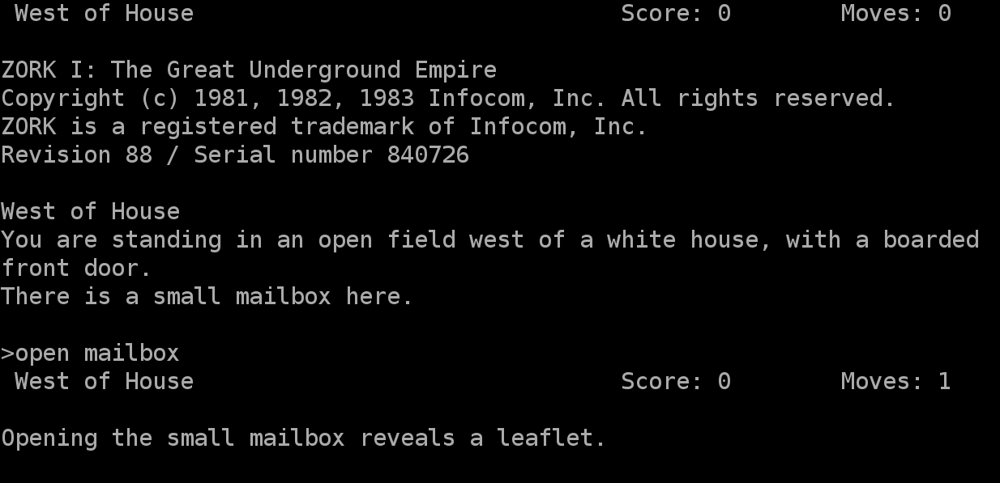
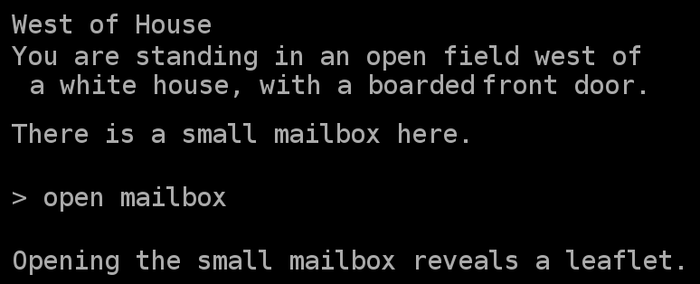

Custom Environment
==================

Making new Environments is useful when games output more information than needed (e.g. a header). It is also useful for detecting when a game ends (either win or lose) since most games have different ways of letting the player knows the game has ended.

This page will guide you through creating a new environment. You should have prior knowledge of the :py:class:`textworld.core.Environment` and :py:class:`textworld.core.GameState` classes.

Zork1Environment
----------------
For this tutorial, we will be creating an Environment dedicated to `Zork1 <https://en.wikipedia.org/wiki/Zork_I>`_. You can get a copy of the game from the `Internet Archive <https://archive.org/download/Zork1Release88Z-machineFile/zork1.z5>`_).

Why do we want a new environment?
^^^^^^^^^^^^^^^^^^^^^^^^^^^^^^^^^
Let's start by running the game directly using the native `frotz interpreter <https://github.com/DavidGriffith/frotz>`_ as follows

.. code-block:: bash

    dfrotz path/to/zork1.z5

As we can see (see left column in the table below), Zork1 prints out a header displaying the name of the room, the scores and the number of moves. Also, when we start the game, some version numbers and other information are printed.

All this decorative text is just noise really. One could argue that header contains meaningful information but the `game_state` object the agent receives already should have all that information. So, there is not point in making the task more difficult for the agent than it already is.

+-----------+------------+
| Frotz     | TextWorld  |
+===========+============+
| |zork1|   | |zork1_tw| |
+-----------+------------+

As we can see in the right column of the above table, the input text is more compact.

Building the Zork1Environment
^^^^^^^^^^^^^^^^^^^^^^^^^^^^^
Since `zork1.z5` is a Z-Machine game, we want to leverage the *python-frotz* communication pipeline already in place in :py:class:`textworld.envs.FrotzEnvironment <textworld.envs.zmachine.frotz.FrotzEnvironment>`. To do so, we simply have to subclass it.

::

    from textworld.envs import FrotzEnvironment

    class Zork1Environment(FrotzEnvironment):
        GAME_STATE_CLASS = Zork1GameState

As we can see there is nothing much to modify for this particular environment other than specifying the game state class to use. This is because we only need to clean the output text rather than changing some fundamental behavior of the `FrotzEnvironment`.

Cleaning up the output is essentially done in the :py:class:`Zork1GameState <textworld.envs.zmachine.zork1.Zork1GameState>` (a subclass of :py:class:`GameState <textworld.core.GameState>`) using a bunch of regular expressions. Here's what it looks like

::

    import textworld

    class Zork1GameState(textworld.GameState):

        def _remove_header(self, text):
            cleaned_text = text_utils.remove_header(text)
            return cleaned_text.lstrip("\n")

        def _check_for_death(self, text):
            return "****  You have died  ****" in text

        @property
        def nb_deaths(self):
            """ Number of times the player has died. """
            if not hasattr(self, "_nb_deaths"):
                if self.previous_state is None:
                    self._nb_deaths = 0
                else:
                    has_died = self._check_for_death(self.feedback)
                    self._nb_deaths = self.previous_state.nb_deaths + has_died

            return self._nb_deaths

        @property
        def feedback(self):
            """ Interpreter's response after issuing last command. """
            if not hasattr(self, "_feedback"):
                # Extract feeback from command's output.
                self._feedback = self._remove_header(self._raw)
                if self.previous_state is None:
                    # Remove version number and copyright text.
                    self._feedback = "\n".join(self._feedback.split("\n")[5:])

            return self._feedback

        @property
        def inventory(self):
            """ Player's inventory. """
            if not hasattr(self, "_inventory"):
                # Issue the "inventory" command and parse its output.
                text = self._env.send("inventory")
                self._inventory = self._remove_header(text)

            return self._inventory

        def _retrieve_score(self):
            if self.won or self.lost:
                _score_text = self.feedback
            else:
                # Issue the "score" command and parse its output.
                text = self._env.send("score")
                _score_text = self._remove_header(text)

            regex = r"Your score is (?P<score>[0-9]+) \(total of (?P<max_score>[0-9]+) points\)"
            match = re.match(regex, _score_text)
            self._score = int(match.groupdict()['score'].strip())
            self._max_score = int(match.groupdict()['max_score'].strip())
            return self._score, self._max_score

        @property
        def score(self):
            """ Current score. """
            if not hasattr(self, "_score"):
                self._retrieve_score()

            return self._score

        @property
        def max_score(self):
            """ Max score for this game. """
            if not hasattr(self, "_max_score"):
                self._retrieve_score()

            return self._max_score

        @property
        def description(self):
            """ Description of the current location. """
            if not hasattr(self, "_description"):
                # Issue the "look" command and parse its output.
                text = self._env.send("look")
                self._description = self._remove_header(text)

            return self._description

        @property
        def won(self):
            """ Whether the player has won the game or not. """
            return "Inside the Barrow" in self.feedback.split("\n")[0]

        @property
        def lost(self):
            """ Whether the player has lost the game or not. """
            return self.nb_deaths >= 3

Then the last thing to do is to make TextWorld framework aware of that new environment. This is done by adding a new entry to the `CUSTOM_ENVIRONMENTS` dictionary located in `textworld/envs/__init__.py`.

::

    # Import dedicated environment
    from textworld.envs.frotz.zork1 import Zork1Environment

    CUSTOM_ENVIRONMENTS = {
        "zork1.z5": Zork1Environment
    }

.. role:: bash(code)
   :language: bash

With everything in place, we can check the results using :bash:`tw-play zork.z5`.
