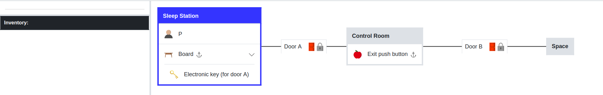

Chapter 3 : How To Design A New Game
==============================================
To design a new game, TextWorld framework provides a library to make a game called `GameMaker`. This library requires
to use game logic and text grammar files which we already discussed about them in previous two chapters. By default,
it employs the built-in versions of these two files. If the new design of the game requires the customized version of
them, they should be addressed and imported to the GameMaker. Thus, the first action, needs to be taken, is importation
of the path in which the customized files are stored. The following three lines of code provide this information for
GameMaker library.

.. code-block:: bash

    from textworld.generator.data import KnowledgeBase

    PATH = pjoin(os.path.dirname(__file__), 'textworld_data')
    kb   = KnowledgeBase.load(target_dir=PATH)

To handcraft a new game, the next is to create an object of GameMaker and start creating rooms and elements of the game.
Assume that our handcrafting game is happening in a spaceship and includes two rooms and there is two doors in the game,
one connects these two rooms and one is on the second room opening to outside (nowhere in this scenario). The `player`
is in the first room and both doors are locked. There is a key and a push button matched with each of these doors. The
goal of the game is to find the keys and go out from the second room. The two rooms and the doors are added to the
world by following block of codes.

.. code-block:: bash

    from textworld import GameMaker

    # ===== World, Rooms, and Doors Design =============================================================================
    gm = GameMaker(kb=kb, theme='Spaceship')
    room_1 = gm.new_room("Sleep Station")
    room_2 = gm.new_room("Control Room")
    room_3 = gm.new_room("Space")

    corridor1 = gm.connect(room_1.east, room_2.west)
    doorA = gm.new_door(corridor1, name="door A")
    gm.add_fact("locked", doorA) # Add a fact about the door, e.g. here it is locked.

    corridor2 = gm.connect(room_2.east, room_3.west)
    doorB = gm.new_door(corridor2, name="door B")
    gm.add_fact("locked", doorB)

which the `new_room` method is designed to create and add a room to the world; the assigned name of the room should be
imported to the method. `Connect` method is used to connect two rooms to each other. The two inputs of this method
are those rooms which are connected in addition to the direction that the connection is occurred; e.g. here room_1 is
connected to room_2 from its "east" side. If there is a door between two rooms, i.e. the connection includes a door;
`new_door` defines this door and asks to describe the location of the door and its name. The final step is adding the
initial state (i.e. fact) of the door to the game, by using `add_fact`. Facts are basically the state of each element
when the game starts.

Now, let's define a key and a table in the Sleep station, in which the key is on the table and it is matched with door
A. The method to create both of these elements is `new`. In this method, the type of new element is defined according
to the type definition of the corresponding element at logic files (.twl file). Also, if the designer wants to add some
description to the element it can add it by the `.info.desc` code. This description is displayed any time that the
player imports `look {.}` command. The newly created item should be located somewhere at the world and if it requires
initial state setup, that is defined as well (see `add` and `add_fact` methods). Look the following example

.. code-block:: bash

    # ===== Box and Key Design =========================================================================================
    table = gm.new(type='s')   # Table is a supporter which is fixed in place in the Sleep Station.
    table.infos.desc = "It is a metal sturdy table."
    room_1.add(table)

    key = gm.new(type='k', name="electronic key")
    key.infos.desc = "This key opens the door into the control room area."
    table.add(key)

    gm.add_fact("match", key, doorA)  # Tell the game 'Electronic key' is matching with door A's lock

From above code, the key is similarly designed and it is on the table. The key and its corresponding door should be
defined by `add_fact` function again, while the fact is `match`, be advised that match fact accepts two inputs. as a
recall, we defined `on(o, s)` as a predicate which means the object is on the supporter (table here), since the key is
defined as a sub-category of object, the `table.add(key)` syntax models this predicate. For the push button, we assume
that it is in room_2. As we observed so far, adding a push button is similar to the rest and just requires `new` method.

.. code-block:: bash

    # ===== Push Button Design =========================================================================================
    push_button = gm.new(type='b', name="exit push button")
    push_button.infos.desc = "This push button is a an object which opens door B."\
                             "This push button is installed on the wall at the control room."
    gm.add_fact("unpushed", push_button)
    room_2.add(push_button)

The player and its inventory are also two important parts of the world which should be defined for the game. If the
designer doesn't define where the player is, then the game will put it automatically at the first designed room. When a
player is set by `set_player` command its location is assigned. The graphical representation of the world is also
available by using `render` method. We recommend the readers of this tutorial, to check all above mentioned methods to
find out more details of how they can be employed more flexible within the design of a new game. The last but not least,
the `quest_record` method compiles the new game, generates the world, and starts the game to play. At each state the game,
the player can see the description of the scene and all the corresponding avaialble actions which transforms the player
to another state.

.. code-block:: bash

    # ===== Player and Inventory Design ================================================================================
    gm.set_player(room_1)

    gm.render(interactive=True)

    gm.record_quest()

The visualization of this game is illustrated at below figure,

+------------------+
|  |game_sample|   |
+==================+
|      Game        |
+------------------+

This tutorial tried to shed a light to Textworld framework and elaborates how new games can be handcrafted using this
framework and cooperate with the customized logic and grammar files.
For further questions please communicate with the technical team of TextWorld project at Microsoft, via ...
