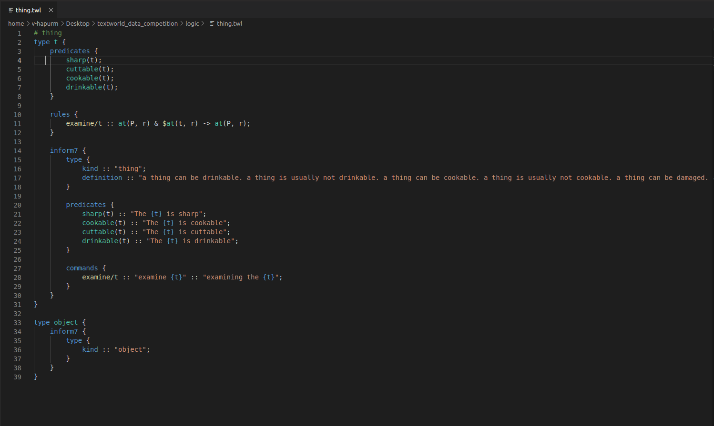

Chapter 2 : Extending the Game Logic
=====================================

TextWorld is a framework to train and test reinforcement learning agents to play text-based games. It enables
generating games from a game distribution parameterized by the map size, the number of objects, quest length and
complexity, richness of text descriptions, and more. Each generated game will follow the same dynamics as
defined by the TextWorld's Game Logic (i.e. entity types, predicates, rules, and contraints).

TextWorld comes with a basic Game Logic that can be used to build games. For instance, it has a limited
set of entity types such as rooms, doors, supporters, containers, objects, etc.
While the builtin Game Logic is very basic, TextWorld allows users to extend it by
modifying or writing new logic files `*.twl`. The basic logic files are collected at following directory:
`TextWorld \\ textworld \\ generator \\ data \\ logic`. These files are built-in logic files and cannot be modified by
the designer for any new theme. Hence, usually designers collect their own files in the following directory:
`TextWorld \\ textworld \\ challenges \\ (new_game_name) \\ textworld_data \\ logic`. Any changes into the basic
entities or any newly designed entity is provided here, and should be called during the "new game design" (This process
is described in `designing_new_game.rst` with more details). For convenience, game logic can be split into multiple
`.twl` files which are going to be aggregated to each other at runtime.

Figure 1 depicts a sample of the `thing` entity.

    Part of the logic file `thing.twl` describing the `thing` entity.

As we can see in the figure, there are different sections in a logic file which need to be provided.
Notably, there's a whole section about Inform7_, a programming language and design system for interactive fiction.
TextWorld has to deal with two different languages simultaneously: the TextWorld's Logic Language (TWLL)
and the Inform7 Language (I7L). TextWorld's engine interprets TWLL while Inform7 compiles I7L into either
Z-Machine (.z8) or Glulx (.ulx) games.
Any additions or modifications to the logic should be defined in **both** languages.

This tutorial goes over the steps needed to add a new type of entity - a push button - in TextWorld.

A. Declaring a new type
-----------------------
World in any text-based game contains various entities which create the world. Each entity within a TextWorld
environment has a *type*. A *type* defines the possible interactions the player can have with different objects (e.g.,
open door), as well as their states (e.g. open/closed or unlock/locked door).
Each type must be represented by a unique identifier composed of letters and dashes.

Let's define the a push button type as follows

.. code-block:: bash

    type push-button {
    }

The basic logic entities, which are categorized as built-in entities in TextWorld framework, are defined and
organized as follows:

.. code-block:: bash

    - room (as "r")
    - Player (as "P")
    - INVENTORY (as "I")
    - thing (as "t") ----------> supporter (as "s")
                           |---> door (as "d")
                           |---> container (as "c")
                           |---> object (as "o") ---------->> food (as "f")
                                                       |--->> key (as "k")

NB: notice how `INVENTORY` is all uppercase. This is used to indicate that there should only be one
object of that type per game.

A *type* can be a subtype (e.g. `food` is a subtype of `portable_object`) which means it will inherit all
of its parent behaviors (e.g. `food` is also *portable*) and can also define new ones (e.g. `food` is edible).

Let's our push button be a subtype of `thing`, so we can interact with it in a game:

.. code-block:: bash

    type push-button : thing {
    }

NB: the type `thing` represents everything that is tangible in a game (e.g. `food`, `containers`, etc.)
opposed to abstract concept like `rooms` and `INVENTORY`.

B. Defining a type
------------------

After declaring the type of an entity, its definition needs to be put between curly braces `{...}`. Its
definition includes various sections.

So far, the `push-button` type will only be recognized by the TextWorld Engine but not the Inform7 compiler.
To fix that, a mapping between TWLL's type and I7L's counterpart - a `kind` - must be establish.

Let's add the relevant I7L code for the `push-button`:

.. code-block:: bash

    type push-button : thing {

        inform7 {
            type {
                kind :: "push-button";
            }
        }
    }

The above example presents the type in both languages. Another relevant and simple example is a built-in entity inside
the TextWorld framework, called `door`. Below is the details of the door entity:

.. code-block:: bash

    # door
    type door : thing {

        inform7 {
            type {
                kind       :: "door";
                definition :: "door is openable and lockable. A door is usually locked.";
            }
        }
    }

The designer, here, prefers to add two features to the `door` type, as openable and lockable. Any feature which is
supposed to be as general feature of this type can be mentioned in `definition`. Moreover, if there is an initial state
that the designer prefers to define to start the game with, should be mentioned in the definition part. For instance,
the designer of our example game likes to have all doors in the game locked by default, when the game starts. Then "A
door is usually locked." is added to definition. Similarly for a cloth, we can say "cloth are cleanable. A cloth is
usually clean.".

Each game usually include a few rooms with various entities in them. The combination of the initial state of each
entity of the game (like a door which is either locked or open) creates the initial state of the game in general. The
game continues state-to-state when the current state of any entity of the game changes, e.g. the locked door changes
to unlocked (but closed). This is how the Text-based games perform.

C. Defining a predicate
-------------------------

The next section of a logic file is a "Predicate", which describes various state definition of the logic of the entity
using the TWLL. For instance, the states of a door can be either open/close or locked/unlocked. Another feature that
can be defined as predicate is the connectivity of this entity with other entity(ies) in the environment. For example,
a door can link two rooms, described as `link(r, door, r')`, or an object like a glass can be put on a supporter like a
table, described as `on(o, s)`, which `o` stands for object type and `s` stands for supporter type. Any other feature
which defines the state of the entity (in some way it also describes the state of the game), and designer would like
to add it, should be described for the framework in TWLL format in the predicate part. Following is an example of the
possible states of a door, in TWLL:

.. code-block:: bash

    predicates {
        open(door);
        closed(door);
        locked(door);

        link(room, door, room');
    }

In this example the door can be locked, closed, or open. The unlock state is implicitly defined by closed state. This
door also links two rooms as described. After defining predicates in TWLL, similar to previous part, the predicates
should be described in I7L as well. The following code presents this in both languages

.. code-block:: bash

    # door
    type door : thing {
        predicates {
            open(door);
            closed(door);
            locked(door);

            link(room, door, room');
        }

        inform7 {
            type {
                kind       :: "door";
                definition :: "door is openable and lockable. A door is usually locked.";
            }

            predicates {
                open(door)   :: "The {door} is open";
                closed(door) :: "The {door} is closed";
                locked(door) :: "The {door} is locked";

                link(room, door, room') :: "";  # No equivalent in Inform7.
            }
        }
    }

There are important notes in this example which is good to elaborate them:

    a. The Inform7 language is very close to simple English language. However, some conditions and exceptions are
    applied. For details of Inform7 language please check `http://inform7.com`.

    b. Each type has a unique name which can contain a letter, a word, or combination of either with dash. A door also
    have a specific name in the game which helps to identify it among all the doors in the game e.g. "wooden door".
    Assigning a specific name to each entity of the game is generally an appropriate solution to distinguish between
    different entities of the same type (like wooden door vs. glass door). This name is assigned to `{door}` in the
    I7L-based text; i.e. "The wooden door is open".

    c. There might be some predicates that the designer would like to define as the logic of the game and they don't
    have an I7L equivalent necessarily, like `link(.)` in this example. The framework basically understands it by
    defining as empty I7L-based description and performs as designer's wish with no harm.

    d. To make a line as comment, just put a `#` sign at the beginning of the line.

Basically a door links two rooms and if it is lockable, there is a key in the game which is
matched with this door. Key is also a built-in entity. As we have already mentioned, TextWorld has some built-in
designed entities and many games may require other entity(ies) in addition to the built-in ones. Our push-button example
is one relevant example which is NOT already defined in the built-in entities list. The framework doesn't know what is
a push button. Moreover, let's assume that a game designer likes to create a game in which a door can be unlock and open
by a push button. What does she/he do, since the framework doesn't know that the entity, like push button, can unlock
and open a door? Similar to the door, some primary predicates is required to be defined for a push button, as described
here:

.. code-block:: bash

    # push button
    type push-button : thing {
        predicates {
            pushed(push-button);
            unpushed(push-button);

            pair(push-button, door);
        }

        inform7 {
            type {
                kind :: "button-like";
                definition :: "A button-like can be either pushed or unpushed. A button-like is usually unpushed. A button-like is fixed in place.";
            }

            predicates {
                pushed(push-button)   :: "The {push-button} is pushed";
                unpushed(push-button) :: "The {push-button} is unpushed";

                pair(push-button, door) :: "The {push-button} pairs to {door}";
            }
        }
    }

D. Defining a command
-----------------------

A command (or rule) activates an action in the game and should be defined in both languages. "Rule" section is another
section of logic file. It describes how the game transforms from one state to another by using the command; see the
below example for a simple `open` rule which is used to open a door,

.. code-block:: bash

    open/d :: $at(P, room) & $link(room, door, room') & $link(room', door, room) & closed(door) -> open(door) & free(room, room') & free(room', room);

where `at(P, room)` means "the player is at the room" and `free(room, room')` means the path from firs room (called
`room` here) to the second room (which is called `room'`) is clear. This rule includes two columns which are separated
by a `::`. The left column presents the rule's name. This name should be unique for each rule, thus, if we have two
states with different conditions, then their names should be different, for instance "open/d" vs "open/c" which stand
for open door and open container, consecutively.

The right column of the above rule describes the state change of the game according to the current change and the next
state which the game will turn to, by using this command. As it is depicted, each state contains some predicates
which describe the conditions applied to the entities of the game at that moment (or state) of the game, and provides
eligibility for the defined rule to be applied/called. After calling the rule, it is activated and makes some changes
into the state of the game (or equivalently some selected entities of the game) as it is described on the right side of
the arrow. By these changes, the game will finally transit to the next state. Please be notified that any predicate
which is supported by `$` sign will be kept as unchanged at the next state. Therefore, it is not necessary to repeat
them at the right side of the arrow.

Equivalently, the I7L version of this rule should be coded in the inform7 part, which is translated again as `open {d}`.
When this command is imported by the player, the inform7 will return a response as the game state, which in this example
is `opening {d}`. This inform-based output is important for the TextWorld framework to identify that the inform
compiler has taken the action of the command (here opening the door) and has transited to the next state. This can be
assumed as acknowledgment to the framework to change the status. All these information are coded in `command`
sub-section inside the inform7 part in the logic file, which is given as

.. code-block:: bash

    inform7 {
            ...

            commands {
                open/d :: "open {d}" :: "opening {d}";
            }
        }
    }

E. Defining a new command to Inform7
-------------------------------------

The push button is basically a sub-set of thing, and it is paired with a door. However, "pair" action is not defined in
I7L, thus it should be defined and described for Inform7 that what it means when a door and a push button are paired.
The description of new concept to I7L is always provided in "code" sub-section within the inform7 section in the logic
file. As a continuum to our example, below the "pair" and corresponding action, `push`, is defined for I7L:

.. code-block:: bash

    # push button
    type push-button : thing {
            ...

        inform7 {
            ...

            code :: """

                connectivity relates a button-like to a door. The verb to pair to means the connectivity relation.

                Understand the command "push" as something new.
                Understand "push [something]" as _pushing.
                _pushing is an action applying to a thing.

                Carry out _pushing:
                    if a button-like (called pb) pairs to door (called dr):
                        if dr is locked:
                            Now the pb is pushed;
                            Now dr is unlocked;
                            Now dr is open;
                        otherwise:
                            Now the pb is unpushed;
                            Now dr is locked.

                Report _pushing:
                    if a button-like (called pb) pairs to door (called dr):
                        if dr is unlocked:
                            say "You push the [pb], and [dr] is now open.";
                        otherwise:
                            say "You push the [pb] again, and [dr] is now locked."
            """
        }
    }

In this example, the "push" command is defined; the compiler expects to have a syntax such as "push [something]" which
the [something] usually is replaced by the name assigned to the push button. It is also described that what changes
are expected to happen when the button is pushed; the button state should change from `unpushed` to `pushed`, the door
state also should be changed from `unlocked` to `open`. The last block is for human interaction and prints out these
changes, thus, it is not mandatory.

To open a locked door with a push button, it is necessary to have the player at the same room as the push button is.
Then the door is paired with the button, and the two rooms that this door connects to each other should be declared
(note: the door and the button can be located in two different rooms, compare the first and the second set of rules
in below example).
Also the door is locked and the button is unpushed. From the `code` section, we realized that the defined command for
this state transition is "push {b}". After this action, the door is unlocked and open and the button is changed to
pushed. The rest of the conditions (predicates) are unchanged. This process is presented in following example for two
scenarios: a) the button and the door ar at the same room, b) the push button is in separate room than the door.

.. code-block:: bash

    rules {
        lock/close/db   :: $at(P, room) & $at(push-button, room) & $pair(push-button, door) & $link(room', door, room) & $link(room, door, room') & pushed(push-button) & open(door) & free(room, room') & free(room', room) -> unpushed(push-button) & locked(door);
        unlock/open/db  :: $at(P, room) & $at(push-button, room) & $pair(push-button, door) & $link(room', door, room) & $link(room, door, room') & unpushed(push-button) & locked(door) -> pushed(push-button) & open(door) & free(room, room') & free(room', room);

        lock/close/d/b  :: $at(P, room) & $at(push-button, room) & $pair(push-button, door) & $link(room', door, room'') & $link(room'', door, room') & pushed(push-button) & open(door) & free(room', room'') & free(room'', room') -> unpushed(push-button) & locked(door);
        unlock/open/d/b :: $at(P, room) & $at(push-button, room) & $pair(push-button, door) & $link(room', door, room'') & $link(room'', door, room') & unpushed(push-button) & locked(door) -> pushed(push-button) & open(door) & free(room', room'') & free(room'', room');
    }

    reverse_rules {
        lock/close/d/b :: unlock/open/d/b;
        lock/close/db  :: unlock/open/db;
    }

    inform7 {
        ...

        commands {
            lock/close/d/b  :: "push {push-button}" :: "_pushing the {push-button}";
            unlock/open/d/b :: "push {push-button}" :: "_pushing the {push-button}";

            lock/close/db   :: "push {push-button}" :: "_pushing the {push-button}";
            unlock/open/db  :: "push {push-button}" :: "_pushing the {push-button}";
        }
    }

As this example illustrates, since the same command is used for an action in two different situations, the rule names
are different, although the command and the inform7 acknowledgement are all the same.

Have you noticed the reverse_rule section? In this section, the reverse rules are connected to each other to inform the
framework that after taking an action what would be the reverse action to get back to the current state. This provides
the possibility of getting back to a state after moving from it, also provides back and forth exploration within the
environment.

F. Defining constraints
-----------------------

The last section of a logic file is the `constraints` which defines the failure rules; i.e. describes that which
predicates cannot occur simultaneously in a state. This section is only required to be defined in TWLL. Following is an
example of some selected constraints applied to our example,

.. code-block:: bash

    constraints {
        # Predicate conflicts
        d1 :: open(door)   & closed(door) -> fail();
        d2 :: open(door)   & locked(door) -> fail();
        d3 :: closed(door) & locked(door) -> fail();

        # A door can't be used to link more than two rooms.
        link1 :: link(room, door, room') & link(room, door, room'') -> fail();
        link2 :: link(room, door, room') & link(room'', door, room''') -> fail();
    }

.. _Inform7: http://www.inform7.com/
