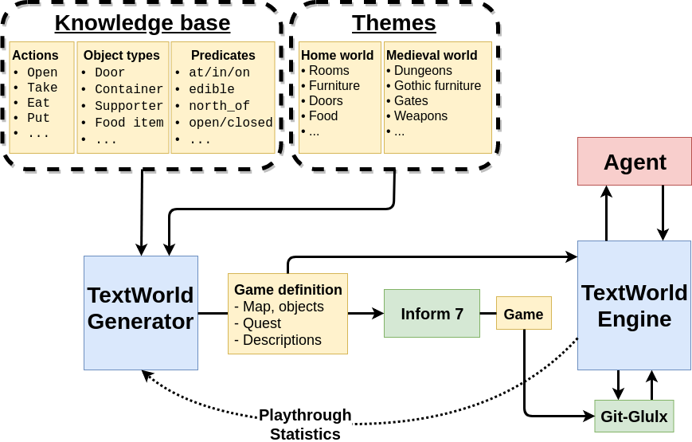

What is TextWorld?
==================

TextWorld is a sandbox learning environment for training and testing reinforcement learning (RL) agents on text-based games. It enables generating games from a game distribution parameterized by the map size, the number of objects, quest length and complexity, richness of text descriptions, and more. Then, one can sample game from that distribution. TextWorld can also be used to play existing text-based games.

